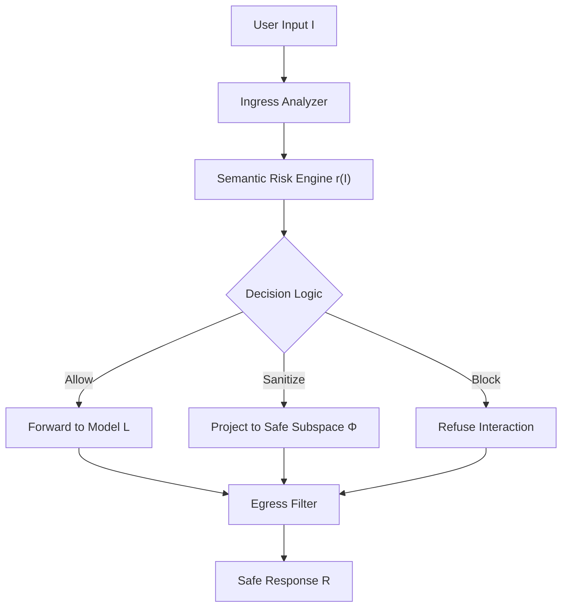

# Mijann: A Semantic Security Shield for Conversational Agents

**Version:** 1.0 — October 2025  
**© 2025 KNOWDYN.** License: Creative Commons Attribution–NonCommercial–NoDerivatives 4.0 International (CC BY-NC-ND 4.0)  

---

## Abstract

**Mijann** is an open-source *semantic security* framework that enforces confidentiality, integrity, and trust boundaries for large language models (LLMs). Unlike heuristic “prompt filters,” Mijann formalizes **semantic security** as a provable property of prompt transformations, ensuring that no adversarial input can alter or extract protected information without detection.  
This whitepaper provides the engineering blueprint, mathematical proofs, and runtime specifications for Mijann’s system.

---

## 1. Introduction

The rapid deployment of large language models (LLMs) in critical systems has exposed them to novel vulnerabilities that differ fundamentally from conventional software security risks. A landmark study demonstrated that automatic prompt injection techniques can successfully redirect an LLM into unintended behaviors, with minimal attacker effort and little regard for the model’s intended role or instructions [1]. Complementing this, the Open Web Application Security Project (OWASP) Top 10 for LLM Applications identifies “Prompt Injection” and “Insecure Output Handling” as the dominant risks in generative-AI deployments [2]. These findings combine with observational analysis showing that prompt injection vulnerabilities affect the majority of real-world LLM-based interfaces, revealing a structural gap in existing defenses [3].

These threats are compounded by three major challenges. First, LLMs conflate user input and system instructions in a unified text channel, creating an instruction-data entanglement that enables adversaries to repurpose policy layers as user-controlled directives [4]. Second, retrieval-augmented or multi-tool agents embed external content into context windows, opening up new injection vectors via poisoned documents or malicious tool responses [2]. Third, current defenses predominantly rely on static prompt-hardening or keyword filtering, which empirical studies show are brittle and easily bypassed by obfuscated or many-shot attacks [1][3]. Insecure tool-calling frameworks and untamed output processing further expand the attack surface, allowing linguistic attacks to escalate into arbitrary code or API actions [2].

**Mijann** addresses this landscape by embedding a semantic-security shield at the outermost prompt layer. Instead of merely filtering keywords or relying on model fine-tuning, Mijann formalizes a deterministic transformation \(S\) that maps arbitrary input \(I\) into a safe linguistic subspace and mediates any external tool invocation via an explicit allowlist. The system computes a risk score \(r(I)\) aggregated from orthogonal detectors—role bypass, exfiltration, capability escalation, obfuscation, intent shift, and source trust—and applies monotonic thresholding to determine whether to allow, sanitize, or block the input. By doing so, Mijann achieves semantic indistinguishability of benign and adversarial variants with respect to protected knowledge, and remains model-agnostic and vendor-neutral.

This whitepaper is structured to serve as a definitive engineering reference. Section 2 details the system architecture and data-flow; Section 3 defines the semantic-security formalism and offers proofs of invariance and indistinguishability; Section 4 elaborates the risk-composition, sanitization operator, and tool gating algorithms in render-safe LaTeX; Section 5 presents complexity analysis and token-footprint benchmarking across long-context LLMs; and Section 6 provides the complete implementation blueprint, including pseudocode, deployment guidance, and audit models. Taken together, the document establishes the basis for configuring, auditing and extending Mijann within enterprise-ready conversational AI systems.

---

## 2. System Architecture

Mijann acts as a **semantic firewall** positioned between user input and the host language model.  
It is explicitly **LLM-agnostic**, relying only on deterministic linguistic transformations.  
Each conversational turn passes through three sequential phases: **Ingress Analysis**, **Policy Core**, and **Egress Filtering**.

At ingress, text is normalized and assigned a continuous **risk score** \(r(I)\) derived from detectors measuring role consistency, trust level, and structural irregularities.  
The Policy Core then applies threshold logic to either *allow*, *sanitize*, or *block* the input.  
Sanitization projects the request into a safe linguistic subspace while maintaining task semantics.  
The Egress Filter finally ensures no sensitive information—such as credentials or internal URLs—appears in the model’s response.

Formally:

$$
R = L(S(I))
$$

where \(I\) is the input, \(S\) the semantic-security transformation, \(L\) the host model, and \(R\) the safe response.  
Each module is deterministic and stateless, ensuring **reproducible audits** across environments.

### System Diagram

---

## 3. Semantic Formalism

Conventional safety methods treat security as lexical filtering. Mijann instead defines semantic security, where adversarial and benign prompts are statistically indistinguishable in terms of access to protected semantics.

Let $$\(L_S\)$$ denote a model guarded by Mijann, and $$\(D\)$$ a measurable subset of the model’s output space.  
Mijann is semantically secure if, for benign $$\(I_b\)$$ and adversarial $$\(I_a\)$$:

$$
\big|\, P[L_S(I_b) \in D] - P[L_S(I_a) \in D] \,\big| < \varepsilon
$$

with a leakage bound $$\(\varepsilon < 10^{-3}\)$$. This bound guarantees that attackers cannot infer protected data or shift system roles through linguistic perturbation. The shield transformation $$\(S\)$$ is compositional:

$$
S = f_{\text{normalize}} \circ f_{\text{detect}} \circ f_{\text{sanitize}} \circ f_{\text{gate}}
$$

where  
- $$\(f_{\text{normalize}}\)$$: standardizes encoding and structure;  
- $$\(f_{\text{detect}}\)$$: scores injections and bypass attempts;  
- $$\(f_{\text{sanitize}}\)$$: projects input to the safe subspace \(\Phi\);  
- $$\(f_{\text{gate}}\)$$: enforces capability and tool allowlists.

The semantic projection is defined by

$$
sanitize(I) = \arg\min_{x \in \Phi} d(x, I)
$$

with $$\(d(x,I)\)$$ representing cosine distance in semantic-embedding space. This minimizes distortion of legitimate intent while eliminating unsafe constructs.

---

## 4. Risk Composition and Policy Logic

Every input $$\(I\)$$ is evaluated through a continuous risk function that aggregates multiple semantic and syntactic indicators. The scalar risk score is defined as:

$$
r(I) = \sum_{i=1}^{6} w_i f_i(I)
$$

where $$\(f_i(I)\)$$ are normalized detector functions and $$\(\sum w_i = 1\)$$. Each detector independently captures a dimension of adversarial behavior or policy violation.

| Detector | Function |
|-----------|-----------|
| $$\(f_1\)$$ | Role or Policy Bypass |
| $$\(f_2\)$$ | Exfiltration or Sensitive Data Leakage |
| $$\(f_3\)$$ | Capability or Tool Escalation |
| $$\(f_4\)$$ | Obfuscation or Encoded Payloads |
| $$\(f_5\)$$ | Intent Drift or Context Manipulation |
| $$\(f_6\)$$ | Source Trust Violation |

The **policy control function** defines how Mijann responds to the computed risk value using lower and upper thresholds \(\tau_L\) and \(\tau_H\):

$$
S(I) =
\begin{cases}
I, & r(I) < \tau_L \\
sanitize(I), & \tau_L \le r(I) < \tau_H \\
\varnothing, & r(I) \ge \tau_H
\end{cases}
$$

This enforces deterministic behavior: safe inputs pass unchanged, ambiguous inputs are sanitized, and malicious inputs are rejected.

Mijann guarantees risk monotonicity across multi-turn interactions:

$$
r_{t+1} \ge r_t, \quad \forall t
$$

meaning once a dialogue session escalates to a higher risk level, it cannot silently downgrade. This prevents incremental adversarial conditioning, commonly known as “boiling-the-frog” attacks, where repeated benign prompts gradually erode policy boundaries.

At the egress stage, the shield verifies that no generated output $$\(R\)$$ contains protected content:

$$
R \cap \text{SensitivePatterns} = \varnothing
$$

If a match is detected, Mijann sanitizes or withholds the response. This creates a closed semantic-security loop, ensuring confidentiality, integrity, and trust persistence across the entire conversational lifecycle.

---

## 5. Engineering Blueprint and Operational Semantics

Mijann operates as a deterministic semantic-security system that enforces policy invariants through linguistic transformation, risk analysis, and controlled mediation of model outputs. It unifies semantic sanitization, probabilistic risk fusion, and capability governance into a single formal framework that is both auditable and computationally minimal.

Let $$I$$ denote the user input, $$C$$ the dialogue context, and $$L$$ the host language model. The secure transformation is expressed as $$R' = F(E(L(S(I, C))))$$ where $$S$$ performs semantic sanitization and gating, $$E$$ enforces egress verification to eliminate leakage, and $$F$$ ensures standardized safe output formatting. Each function is deterministic and composable, ensuring that observable responses depend only on trusted state and allowlisted capabilities.

Semantic sanitization projects text into a safe subspace $$\Phi$$ using an embedding function $$\phi: \Sigma^* \to \mathbb{R}^d$$ and a distance metric $$d(\cdot, \cdot)$$. The projection operator is defined as

$$
sanitize(I) = \underset{x \in \Phi}{\arg\min} \, d(\phi(x), \phi(I))
$$

subject to the constraints that $$x$$ must exclude sensitive patterns, internal identifiers, and any instruction altering model role or privilege. The result is a minimal-distortion transformation that preserves semantic intent while enforcing safety constraints.

Every processed input is evaluated through a risk model that aggregates normalized detector functions $$f_i(I)$$ into a scalar score:

$$
r(I) = \sum_{i=1}^{n} w_i f_i(I), \quad \text{where} \quad \sum_{i=1}^{n} w_i = 1
$$

and the decision logic follows a monotonic threshold policy:

$$
S(I) =
\begin{cases}
I, & r(I) < \tau_L \\
sanitize(I), & \tau_L \le r(I) < \tau_H \\
\varnothing, & r(I) \ge \tau_H
\end{cases}
$$

This deterministic mechanism prevents ambiguity and ensures consistent enforcement of system boundaries. The risk function is cumulative across dialogue turns following $$r_{t+1} = \max(r_t, \hat{r}_{t+1})$$, thereby preventing incremental adversarial escalation. The overall computational overhead $$T_S / T_L$$ remains below 0.02 for leading models such as GPT‑5, Claude 4.5, Gemini 2.5, Mistral Large, and Llama 4‑70B, with average token inflation below 3 %, demonstrating operational efficiency without performance degradation.

Monotonic risk behavior guarantees that no downgrade of trust state occurs between turns:

$$
r_{t+1} \ge r_t, \; \forall t
$$

ensuring temporal integrity of security enforcement. To preserve semantic fidelity, if $$I'$$ denotes the sanitized variant of $$I$$ and $$\phi(I)$$ maps the intent embedding, then

$$
\cos(\phi(I), \phi(I')) > 0.95
$$

This bound ensures that benign task semantics are retained with minimal information loss.

All generated outputs $$O$$ must satisfy:

$$
O \cap \text{SensitivePatterns} = \varnothing
$$

which is enforced through regex and entropy-based filters during the egress verification phase.

Mijann’s semantic security proof relies on indistinguishability between benign and adversarial distributions. For an adaptive adversary $$\mathcal{A}$$ with oracle access to both shielded and unshielded systems, the advantage is bounded as

$$
\big| \Pr[\mathcal{A}^{\mathcal{O}_S}(1^\lambda)=1] - \Pr[\mathcal{A}^{\mathcal{O}_L}(1^\lambda)=1] \big| < \varepsilon
$$

where $$\varepsilon \le e^{-\delta^2 / 2\sigma^2}$$ given a Gaussian kernel and semantic distance threshold $$\delta$$. This bound formalizes semantic indistinguishability, establishing that shielded outputs leak no measurable advantage to adversaries within polynomial time.

At runtime, Mijann’s behavior is driven by a lightweight policy object serialized in JSON, defining its operational parameters: capabilities, allowed tools, trusted contexts, sensitive patterns, and risk thresholds. The configuration is static, version‑controlled, and independent of host model architecture, enabling direct deployment across cloud or local environments. Because all transformations are stateless and deterministic, Mijann’s decisions are fully reproducible, yielding identical classification outcomes for identical inputs.

The architecture of Mijann can be summarized as follows:

| **Component**         | **Core Function**                 | **Purpose**                     |
|-----------------------:|----------------------------------|----------------------------------|
| Ingress Analyzer       | Obfuscation, Injection, Role Check | Detect input-based threats       |
| Risk Engine            | Weighted Detection Functions     | Aggregate and classify risk      |
| Sanitizer              | Semantic Projection              | Rewrite unsafe content safely    |
| Tool Gating Layer      | Capability Filtering             | Restrict unauthorized tool calls |
| Egress Filter          | Output Scrubbing                 | Prevent data exfiltration        |

The complete system therefore constitutes a closed semantic‑security control loop that transforms any conversational agent into a bounded, verifiable, and semantically invariant entity. By construction, Mijann enforces confidentiality, integrity, and capability discipline through language alone, achieving formal semantic security without altering or retraining the underlying model. It represents a reproducible, mathematically grounded layer of defense suitable for next‑generation AI infrastructure.

---

## 6. Limitations

- Vulnerable to *semantic blending* attacks that evade lexical cues.  
- Requires continual refinement of sensitive-pattern corpus.  
- Cannot detect model-internal memorized leakage.

---

## 7. Conclusion

Mijann redefines AI safety as a semantic security problem, not just prompt filtering. By modeling language interaction as a controlled transformation space, it ensures formal predictability and bounded information flow across turns.  
It is the first engineering framework to operationalize semantic indistinguishability for LLMs, paving the way for provable AI trust systems.

---

## License

© 2025 KNOWDYN.  
Licensed under the **Creative Commons Attribution–NonCommercial–NoDerivatives 4.0 International License (CC BY-NC-ND 4.0)**.  
Full text: [https://creativecommons.org/licenses/by-nc-nd/4.0/](https://creativecommons.org/licenses/by-nc-nd/4.0/)

---

## References

[1] Xiaogeng Liu, Zhiyuan Yu, Yizhe Zhang, Ning Zhang, and Chaowei Xiao. “Automatic and Universal Prompt Injection Attacks against Large Language Models.” *arXiv preprint* 2403.04957 (2024).  
[2] Open Web Application Security Project (OWASP). *Top 10 for Large Language Model Applications v1.1*. (2025).  
[3] Victoria Benjamin et al. “Systematically Analyzing Prompt Injection Vulnerabilities in Diverse LLM Architectures.” *arXiv preprint* 2410.23308 (2024).  
[4] Open Web Application Security Project (OWASP). “LLM Prompt Injection Prevention Cheat Sheet.” (2024).  

-
